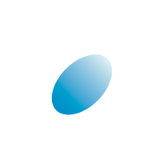

---
# This is a full listing of available Frontmatter options, available for any content (.md) file.
title: Achberger Mediation Konfliktberatung
layout: page
excerpt: # used for page excerpts and META (will be overwritten if SEO used below)
author: Hans-Peter Achberger # only displayed on Post lists and detail views. Defaults to _data/meta.authorURL
eleventyNavigation: # Required if want to display in Main Nav Bar
  key: main # "main" is required
  title: Home # as it will appear in the nav
  order: 1 # order to display in the nav (index = 1)
seo: # SEO values are used for OG and will overwrite 'title' and 'excerpt' above
  title:
  description:
  image: # used for OG:image and Twitter:image. Overrides default set in _data/meta.siteImage
hero: graphic # options: carousel, graphic, video, split (text & image)
heroSettings:
  height:
    mobile: # options = h-1/1 (default = full screen), h-1/2, h-1/3, h-3/4, h-9/10, h-48 (12rem, 192px), h-56 (14rem, 224px), h-64 (16rem, 256px)
    desktop: h-3/4 # leave blank to inherit "mobile" height (default = full screen)
  bg:
    color: bg-grey-500 # default bg-black
    image: home/cover.jpg # relative to /assets/images/
    imagePosition: # options = bg-center (default), bg-left, bg-right
    opacityMobile: opacity-100 # options opacity-n, 5, 10, 15, 20, 25, 50, 75, 100 (default)
    opacityDesktop: # Leave blank to inherit opacityMobile, use same options as opacityMobile
  headingText: Achberger Mediation und Konfliktberatung
  headingLogo: assets/images/logo-mit-text-nobg.png
  headingTextColor: # default = text-white (can use any TailwindCSS text-[color]-[xxx])
  headingTextCase: # default = as typed - options: uppercase, lowercase, capitalize
  subheadingText: # Mediation ist die Wurzel alles Guten. - Nietsche
  subheadingTextColor: # Leave empty to inherit headingTextColor or default (text-white) or use any text-[color]-[xxx]
  buttonText: # Lösen Sie Ihren Konflikt... # no button generated if left blank
  buttonURL: # /kontakt/ # full url required. Example: https://thisdomain.com/somepage/
  buttonTextColor: # leave blank to inherit from /src/_data/colors.buttonCustom or buttonDefault
  buttonBgColor: # leave blank to inherit from /src/_data/colors.buttonCustom.bg or buttonDefault.bg
  buttonBgHover: # leave blank to inherit from /src/_data/colors.buttonCustom.bgHover or buttonDefault.bgHover
  buttonBorder: # leave blank to inherit from /src/_data/colors.buttonCustom.border or buttonDefault.border
---







#### Mediation

Paar- und Familienmediation
Trennungs- und Scheidungsmediation
Unterhalts- und Betreuungsfragen

Mediation für Organisationen,
Vereine, Vereinsorgane, Verbände, Grossgruppen etc.






#### Konfliktberatung

Beratung für Paare und Familien im Umgang mit Konflikten
Beratung für Organisationen
Fragen der Vereinsführung bzw. des konstruktiven Umgangs mit Konflikten
Konfliktmanagement und Einrichtung eines Konfliktmanagementsystems






